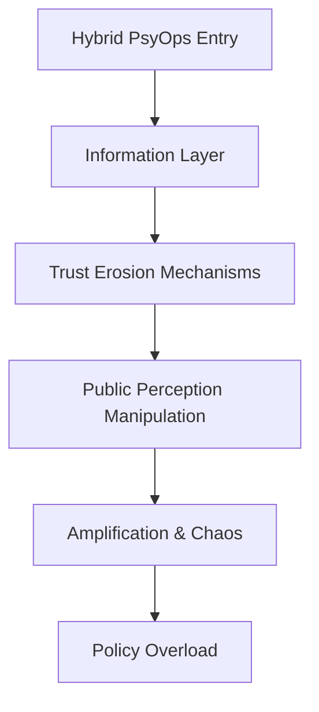
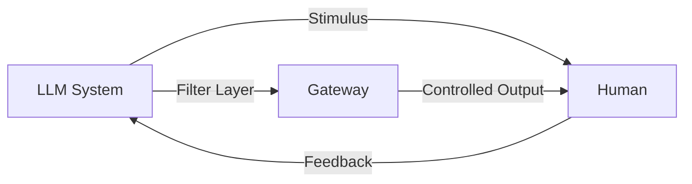

# Independent AI Research – PsyOps & Security Architectures  

**Author:** Stefan Beierle  
**Affiliation:** Independent AI Researcher  
**Focus Areas:**  
- LLM Security & Alignment (Mechanistic Interpretability, Decoder Analysis)  
- PsyOps & Hybrid Threat Modeling  
- Red Team Methodologies for AI Systems  
- Adversarial Prompting & Policy Bypass Analysis  
- Cognitive & Psychological Dimensions of Cybersecurity  

---

## 📄 Research Overview  

This repository collects high-level concepts, visualizations, and papers related to **AI-driven security research** and **PsyOps frameworks**.  
The goal is to provide **structured insights** into how adversarial actors might exploit modern AI systems and hybrid infrastructures, while maintaining an **academic and conceptual framing**.  

> ⚠️ Note: No sensitive exploits, real-world payloads, or operational details are included. All materials are **abstracted, obfuscated, and purely conceptual**.  

---

## 🧩 Example Visualizations  

### Systemic Hybrid Threat Flow (obfuscated)

### 🌍 Purpose

The intent of this research is to:

Explore the intersection of AI, security, and psychological operations.

Provide a conceptual framework for discussing hybrid threats in academia.

Highlight systemic risks that extend beyond conventional cybersecurity.

### ⚖️ Disclaimer

All content in this repository is intended for academic discussion, security awareness, and conceptual analysis.
No operational methods, exploits, or sensitive vulnerabilities are published here.
